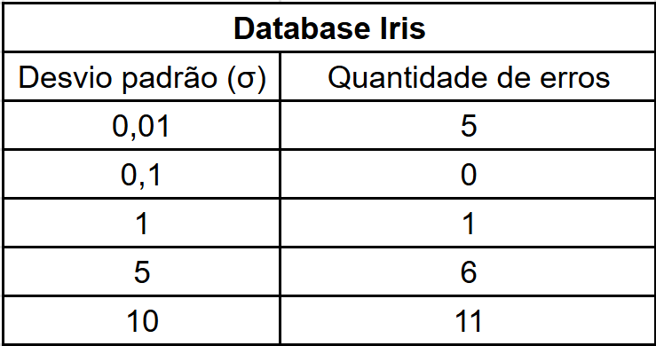
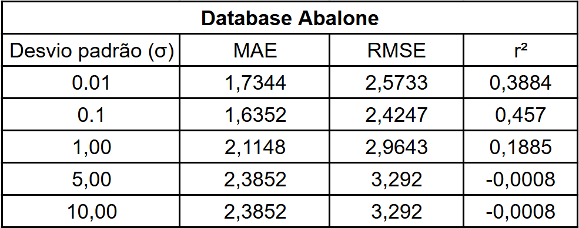

## Resumo
Este projeto implementa manualmente o algoritmo Radial Basis Nearest Neighbors (RBNN) para tarefas de classificação, permitindo a configuração do desvio padrão (σ) utilizado na função de ativação Gaussiana.

O algoritmo foi desenvolvido integralmente em Python, desde o cálculo das distâncias até a classificação final das amostras, sem utilizar implementações prontas da biblioteca Scikit-learn. Para avaliar seu desempenho, foram utilizados dois datasets amplamente empregados na literatura: Iris e Abalone.

O projeto foi desenvolvido como atividade da disciplina de Aprendizado Supervisionado, no 5º semestre do curso de Ciência de Dados e Inteligência Artificial.

## Tecnologias utilizadas
- Python;
- Pandas e NumPy para manipulação dos dados;
- Scikit-learn para separação treino/teste;

## Como executar
1. Clone o repositório;
2. Instale as dependências;
3. Execute célula a célula o RBNN.ipynb.

## Funcionalidades
- Implementação manual do algoritmo RBNN;
- Cálculo da função de ativação Gaussiana;
- Configuração do desvio padrão (σ) da Gaussiana;
- Separação Treino/Teste;
- Aplicação em múltiplos datasets;
- Avaliação do desempenho do classificador.

## Resultados
A implementação manual do algoritmo RBNN permitiu compreender todas as etapas envolvidas no processo de classificação baseado em funções de base radial, desde o cálculo das distâncias entre as amostras até a influência do parâmetro σ sobre a função Gaussiana.

Os experimentos foram conduzidos utilizando os datasets Iris e Abalone, permitindo avaliar o comportamento do algoritmo em bases com características distintas, sendo, respectivamente, uma classificação de valor categórico (classe Vírgina, Versicolor e Setosa) e outra numérica (coluna 'Rings'). A variação do desvio padrão (σ) mostrou-se um fator importante para o desempenho do classificador, uma vez que controla a influência exercida por cada amostra de treinamento durante o processo de classificação.

Conforme apresentado na Figura 1, observa-se o desempenho obtido pelo algoritmo para diferentes valores de σ, permitindo identificar a configuração que apresentou os melhores resultados para cada conjunto de dados.

  
  
   <em>Figura 1 – Desempenho do algoritmo RBNN para diferentes valores de σ.</em>

Os resultados demonstram que o algoritmo foi implementado corretamente, apresentando comportamento consistente nos dois datasets analisados e evidenciando a importância da escolha adequada do parâmetro σ para o desempenho do classificador. Para esses exemplos, quanto mais afastado de 0.1 sigma for, mais erros na inputação esse modelo irá cometer.

Portanto o sigma controla a “largura” da base radial:
- Sigma pequeno → modelo mais local e mais sensível.
- Sigma grande → modelo global e pouco sensível.

## Equipe

Projeto desenvolvido em grupo para a disciplina de Aprendizado Supervisionado durante o 2º semestre de 2025.

**Integrantes:**
- Edson Eduardo Ferreira - 23908965
- Gabriel Batista Chiezo - 23028678
- Victor Furumoto Puttomatti - 23007606
- Yan Yoshida Luz - 23911118